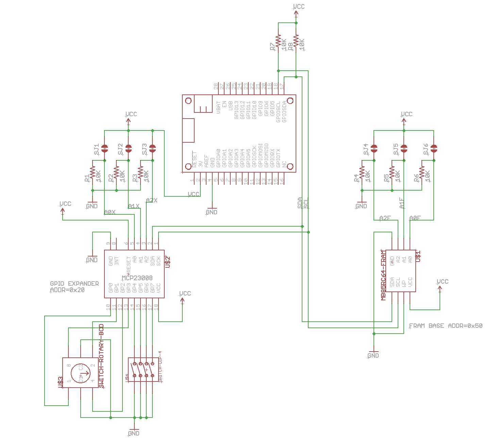

# SwitchFramFeatherRK

*Demo FeatherWing with DIP and BCD switches, and FRAM non-volatile memory*


This project is a simple Adafruit FeatherWing that includes things you might want to include on a board or wing you design:

- DIP switch
- BCD rotary switch
- FRAM (ferro-electric non-volatile memory)

You might use this for configuration of your project, for example.

While the Eagle CAD files and BOM (bill of materials) are included here so you can build your own board exactly like this one, it's really intended to be ideas for things you can include in your own designs.

The other handy thing is that all of the features connected by I2C (pins D0 and D1), so it requires no additional GPIO! 




## Switches

Sometimes you'll want to include physical switches on your board. This demo includes two kinds:

- 4 on-off SPST DIP switches
- A rotary selector that supports values 0-9 by turning the knob

One problem with these types of switches is that they require a lot of GPIO pins. Each requires 4, so rather than tie up 8 GPIO pins on the Argon/Boron/Xenon, an 8-port I2C GPIO expander is used.

The MCP23008 I2C GPIO expander is great for situations like this. It attaches to the I2C bus (pins D0 and D1) and you can include up to 8 of these chips on a single device.

On the left side of the FeatherWing (as pictured above) you'll notice 3 small solder jumpers labeled A0, A1, and A2. By shorting out the solder jumper you can change the I2C address of the MCP23008 chip.

To make this board flexible, the solder jumpers connect to VCC (shorting the jumper sets value 1) and there are 10K pull-down resistors on the address lines. On your own boards you may want to just hardcode the address lines and eliminate the resistors and solder jumpers.

| A2 | A1 | A0 | Address |
| --- | --- | --- | --- | 
| open | open | open | 0x20 |
| open | open | closed  | 0x21 |
| open | closed | open | 0x22 |
| open | closed | closed | 0x23 |
| closed | open | open | 0x24 |
| closed | open | closed  | 0x25 |
| closed | closed | open | 0x26 |
| closed | closed | closed | 0x27 |

The [MCP23008-RK](https://github.com/rickkas7/MCP23008-RK) library is used to read the GPIO lines connected to the chip.


## FRAM

The FRAM (Ferroelectric RAM) is a non-volatile storage device, meaning it keeps the values when power is removed. Unlike flash memory, it's fast to write to and does not wear out, so it's ideal for saving values frequently.

The chip included here is a Fujitsu MB85RC64TAPNF-G-BDERE1, IC FRAM 64K I2C 3.4MHZ 8SOP. It costs $ 1.58 at single quantities so it's affordable to add to your board. It's also tiny, in an 8-SOP package, and connects by I2C, so it doesn't need extra GPIO. That 64 Kbits, so it can store 8 Kbytes of data.

On the right side of the FeatherWing (as pictured above) you'll notice 3 small solder jumpers labeled A0, A1, and A2. By shorting out the solder jumper you can change the I2C address of the FRAM chip.

| A2 | A1 | A0 | Address |
| --- | --- | --- | --- | 
| open | open | open | 0x50 |
| open | open | closed  | 0x51 |
| open | closed | open | 0x52 |
| open | closed | closed | 0x53 |
| closed | open | open | 0x54 |
| closed | open | closed  | 0x55 |
| closed | closed | open | 0x56 |
| closed | closed | closed | 0x57 |

The [MB85RC256V-FRAM-RK](https://github.com/rickkas7/MB85RC256V-FRAM-RK) library makes it easy to use this chip. It provides an API just like the Particle [EEPROM API](https://docs.particle.io/reference/device-os/firmware/#eeprom) to load and save values in the FRAM.


## Sample Code

The sample program prints out the the status of the switches at startup and when the values change. The library takes care of debouncing the switches and reporting changes automatically.

The sample code also stores a counter in FRAM, and the counter is updated once per second.

```
0000005678 [app] INFO: onDipSwitchChange oooo
0000005680 [app] INFO: onBcdSwitchChange 6
0000005684 [app] INFO: counter=908
...
0000015683 [app] INFO: counter=918
0000016093 [app] INFO: onBcdSwitchChange 7
0000016683 [app] INFO: counter=919
0000017683 [app] INFO: counter=920
0000018026 [app] INFO: onBcdSwitchChange 8
0000018684 [app] INFO: counter=921
0000019684 [app] INFO: counter=922
0000019883 [app] INFO: onBcdSwitchChange 7
0000020684 [app] INFO: counter=923
0000021157 [app] INFO: onBcdSwitchChange 6
...
0000028683 [app] INFO: counter=931
0000029289 [app] INFO: onDipSwitchChange |ooo
0000029684 [app] INFO: counter=932
0000030684 [app] INFO: counter=933
0000031684 [app] INFO: counter=934
0000032684 [app] INFO: counter=935
0000033684 [app] INFO: counter=936
0000034217 [app] INFO: onDipSwitchChange oooo
```

You must call from setup:

```
	switchFramFeather.setup();
```

And from loop:

```
	switchFramFeather.loop();
```

This provides time to the library to process the switches.

If you're not familiar with C++11 lambda syntax, this might look peculiar, but it's not that complicated:

```
	switchFramFeather.onBcdSwitchChange([](SwitchFramFeatherRK&, uint8_t value) {
		Log.info("onBcdSwitchChange %d", value);
	});
```

What this does is register a function to be called when the BCD switch value changes. It's just that it's declared in-line using a lambda, rather than having to declare a separate function. 

The Log.info statement will execute and log to debug serial whenever the switch changes (even after setup exits).

The sample code to use the FRAM looks like this:

```
if (millis() - lastCounterUpdate >= 1000) {
		lastCounterUpdate = millis();

		size_t counter;
		switchFramFeather.get(0, counter);
		counter++;
		switchFramFeather.put(0, counter);

		Log.info("counter=%u", counter);
	}
```


## BOM and Assembly

| Quantity | Description | Example | 
| --- | --- | --- |
| 8 | 10K resistor 0603 | [Panasonic ERJ-PA3J103V](https://www.digikey.com/product-detail/en/panasonic-electronic-components/ERJ-PA3J103V/P10KBZCT-ND/5036237) |
| 1 | DIP switch SPST 4 pos | [CTS Electrocomponents 209-4MS](https://www.digikey.com/product-detail/en/cts-electrocomponents/209-4MS/CT2094MS-ND/217664) |
| 1 | DIP Switch BCD 10 Position | [CTS Electrocomponents 220ADC10](https://www.digikey.com/product-detail/en/220ADC10/CT3069-ND/4743855/?itemSeq=273765935) |
| 1 | MCP23008 | [Microchip MCP23008T-E-SO](https://www.digikey.com/product-detail/en/microchip-technology/MCP23008T-E-SO/MCP23008T-E-SOCT-ND/5358243) |
| 1 | IC FRAM 64K I2C 3.4MHZ 8SOP | [Fujitsu MB85RC64TAPNF-G-BDERE1](https://www.digikey.com/product-detail/en/fujitsu-electronics-america-inc/MB85RC64TAPNF-G-BDERE1/865-1274-1-ND/6802280) |
| | Male header pins 0.1" | [Sullins PRPC040SAAN-RC](https://www.digikey.com/product-detail/en/PRPC040SAAN-RC/S1011EC-40-ND/2775214) |


The Eagle CAD files are included in the Github repository. I fabricated my boards at [OshPark](https://oshpark.com). It costs $9 to get 3 FeatherWing boards manufactured (standard speed), with free shipping (in the United States, at least). The other handy thing is that you can upload the .brd file directly and don't have to generate Gerber files.

And while theoretically possible to build this board using solder paste and a soldering iron with a very steady hand, it's intended to be reflowed. I use an inexpensive [T962 Reflow Oven](https://www.amazon.com/SMTHouse-Infrared-Soldering-Machine-Automatic/dp/B0152FTXN2/ref=sr_1_4).

